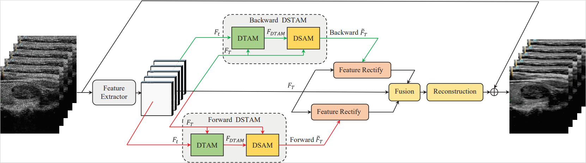
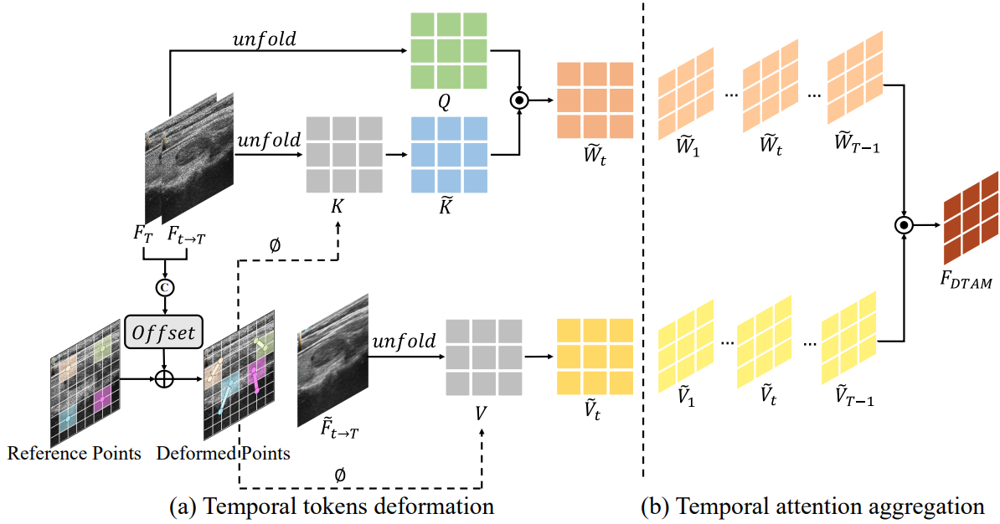
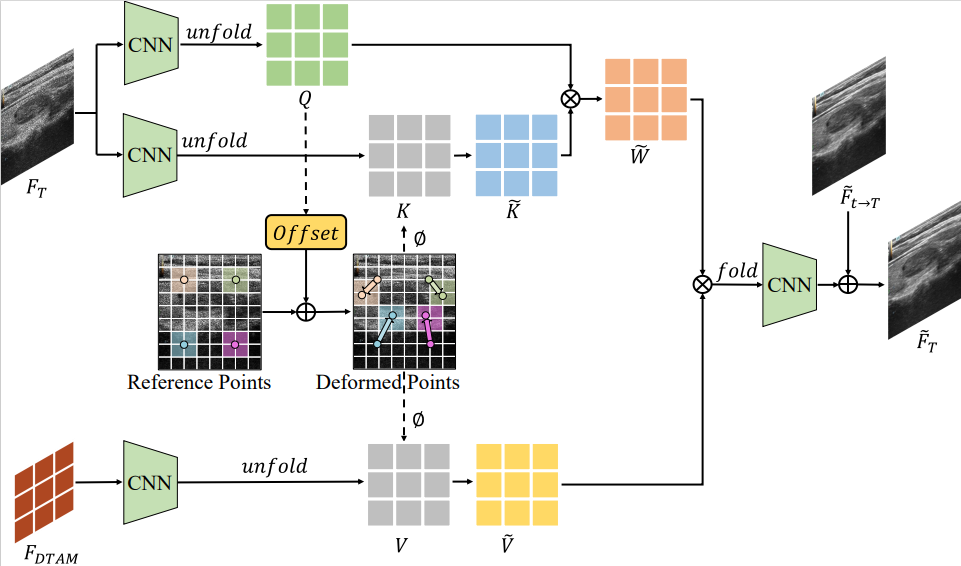
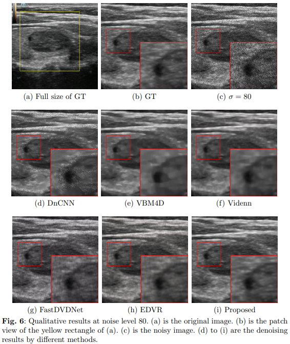
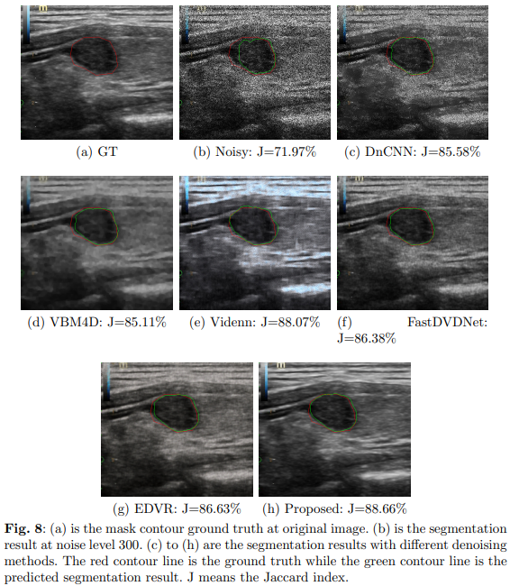

# Video denoising

- **Network**
  
  - Architecture
  
    
  
  - DTAM:可变形时间注意力模块
  
  - DSAM：可变形空间注意力模块
  
    
  

- Experiments

  - 去噪实验

    

  - 分割实验

    

## Test
```
python tools/test.py  configs/DSTAN_thyroid.py checkpoints/iter_45000_sigma300.pth  --save-path exp/denoised
```